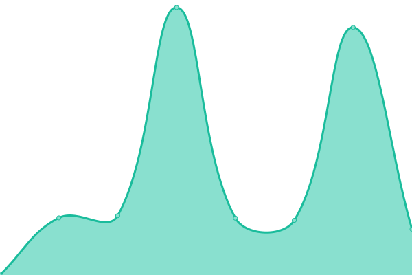

# [📈 Live Status](https://authentiqdigital.github.io/upptime): <!--live status--> **🟧 Partial outage**

This repository contains the open-source uptime monitor and status page for [authentiqdigital](https://www.authentiq.ch), powered by [Upptime](https://github.com/upptime/upptime).

With [Upptime](https://upptime.js.org), you can get your own unlimited and free uptime monitor and status page, powered entirely by a GitHub repository. We use [Issues](https://github.com/authentiqdigital/upptime/issues) as incident reports, [Actions](https://github.com/authentiqdigital/upptime/actions) as uptime monitors, and [Pages](https://authentiqdigital.github.io/upptime) for the status page.

<!--start: status pages-->
<!-- This summary is generated by Upptime (https://github.com/upptime/upptime) -->
<!-- Do not edit this manually, your changes will be overwritten -->
<!-- prettier-ignore -->
| URL | Status | History | Response Time | Uptime |
| --- | ------ | ------- | ------------- | ------ |
|  [Authentiq](https://www.authentiq.ch) | 🟩 Up | [authentiq.yml](https://github.com/authentiqdigital/upptime/commits/HEAD/history/authentiq.yml) | 

 376ms
     
 | 

<a href="https://authentiqdigital.github.io/upptime/history/authentiq">100.00%</a>
    

|  [Contact Tracing](https://ct.authentiq.ch) | 🟩 Up | [contact-tracing.yml](https://github.com/authentiqdigital/upptime/commits/HEAD/history/contact-tracing.yml) | 

 79ms
     
 | 

<a href="https://authentiqdigital.github.io/upptime/history/contact-tracing">100.00%</a>
    

|  [Helpp Admin](https://admin.helpp-app.ch) | 🟩 Up | [helpp-admin.yml](https://github.com/authentiqdigital/upptime/commits/HEAD/history/helpp-admin.yml) | 

 2341ms
     
 | 

<a href="https://authentiqdigital.github.io/upptime/history/helpp-admin">100.00%</a>
    

|  [hp immobilien + verwaltungs ag](https://www.immo-hp.ch) | 🟩 Up | [hp-immobilien-verwaltungs-ag.yml](https://github.com/authentiqdigital/upptime/commits/HEAD/history/hp-immobilien-verwaltungs-ag.yml) | 

 72ms
     
 | 

<a href="https://authentiqdigital.github.io/upptime/history/hp-immobilien-verwaltungs-ag">100.00%</a>
    

|  [Bitfee IT-Dokumentation](https://www.doku.ch) | 🟩 Up | [bitfee-it-dokumentation.yml](https://github.com/authentiqdigital/upptime/commits/HEAD/history/bitfee-it-dokumentation.yml) | 

 4143ms
     
 | 

<a href="https://authentiqdigital.github.io/upptime/history/bitfee-it-dokumentation">95.02%</a>
    

|  [Andreas Iten](https://www.andreasiten.ch) | 🟥 Down | [andreas-iten.yml](https://github.com/authentiqdigital/upptime/commits/HEAD/history/andreas-iten.yml) | 

 277ms
     
 | 

<a href="https://authentiqdigital.github.io/upptime/history/andreas-iten">74.70%</a>
    

<!--end: status pages-->

[**Visit our status website →**](https://authentiqdigital.github.io/upptime)

## 📄 License

- Powered by: [Upptime](https://github.com/upptime/upptime)
- Code: [MIT](./LICENSE) © [authentiqdigital](https://www.authentiq.ch)
- Data in the `./history` directory: [Open Database License](https://opendatacommons.org/licenses/odbl/1-0/)
